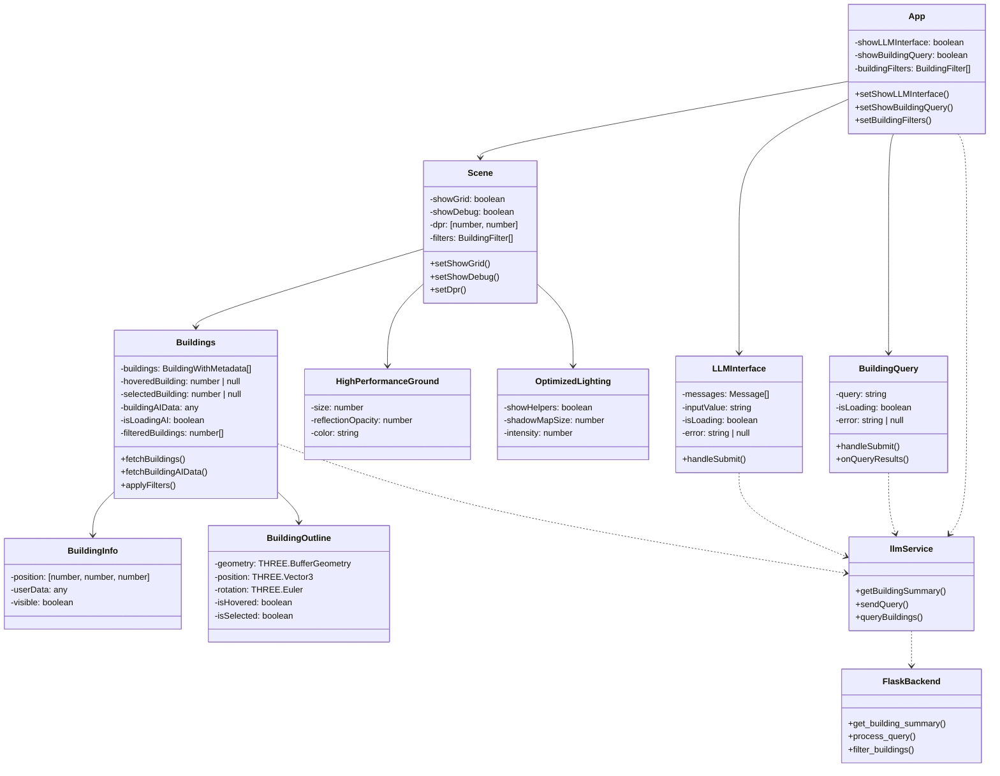
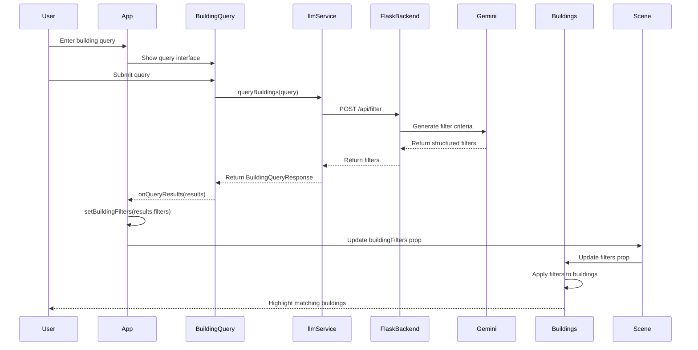
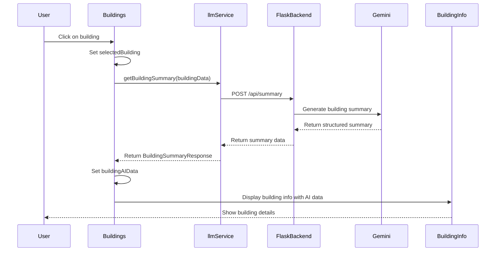

# UML Diagrams for 3D City Viewer

## Class Diagram

```mermaid
classDiagram
    class App {
        -showLLMInterface: boolean
        -showBuildingQuery: boolean
        -buildingFilters: BuildingFilter[]
        +setShowLLMInterface()
        +setShowBuildingQuery()
        +setBuildingFilters()
    }
    
    class Scene {
        -showGrid: boolean
        -showDebug: boolean
        -dpr: [number, number]
        -filters: BuildingFilter[]
        +setShowGrid()
        +setShowDebug()
        +setDpr()
    }
    
    class Buildings {
        -buildings: BuildingWithMetadata[]
        -hoveredBuilding: number | null
        -selectedBuilding: number | null
        -buildingAIData: any
        -isLoadingAI: boolean
        -filteredBuildings: number[]
        +fetchBuildings()
        +fetchBuildingAIData()
        +applyFilters()
    }
    
    class BuildingQuery {
        -query: string
        -isLoading: boolean
        -error: string | null
        +handleSubmit()
        +onQueryResults()
    }
    
    class LLMInterface {
        -messages: Message[]
        -inputValue: string
        -isLoading: boolean
        -error: string | null
        +handleSubmit()
    }
    
    class BuildingInfo {
        -position: [number, number, number]
        -userData: any
        -visible: boolean
    }
    
    class BuildingOutline {
        -geometry: THREE.BufferGeometry
        -position: THREE.Vector3
        -rotation: THREE.Euler
        -isHovered: boolean
        -isSelected: boolean
    }
    
    class HighPerformanceGround {
        -size: number
        -reflectionOpacity: number
        -color: string
    }
    
    class OptimizedLighting {
        -showHelpers: boolean
        -shadowMapSize: number
        -intensity: number
    }
    
    class llmService {
        +getBuildingSummary()
        +sendQuery()
        +queryBuildings()
    }
    
    class FlaskBackend {
        +get_building_summary()
        +process_query()
        +filter_buildings()
    }
    
    App --> Scene
    App --> LLMInterface
    App --> BuildingQuery
    Scene --> Buildings
    Scene --> HighPerformanceGround
    Scene --> OptimizedLighting
    Buildings --> BuildingInfo
    Buildings --> BuildingOutline
    App ..> llmService
    BuildingQuery ..> llmService
    LLMInterface ..> llmService
    Buildings ..> llmService
    llmService ..> FlaskBackend
```

## Sequence Diagram for Building Query

```mermaid
sequenceDiagram
    participant User
    participant App
    participant BuildingQuery
    participant llmService
    participant FlaskBackend
    participant Gemini
    participant Buildings
    
    User->>App: Enter building query
    App->>BuildingQuery: Show query interface
    User->>BuildingQuery: Submit query
    BuildingQuery->>llmService: queryBuildings(query)
    llmService->>FlaskBackend: POST /api/filter
    FlaskBackend->>Gemini: Generate filter criteria
    Gemini-->>FlaskBackend: Return structured filters
    FlaskBackend-->>llmService: Return filters
    llmService-->>BuildingQuery: Return BuildingQueryResponse
    BuildingQuery-->>App: onQueryResults(results)
    App->>App: setBuildingFilters(results.filters)
    App->>Scene: Update buildingFilters prop
    Scene->>Buildings: Update filters prop
    Buildings->>Buildings: Apply filters to buildings
    Buildings-->>User: Highlight matching buildings
```

## Sequence Diagram for Building Selection

```mermaid
sequenceDiagram
    participant User
    participant Buildings
    participant llmService
    participant FlaskBackend
    participant Gemini
    participant BuildingInfo
    
    User->>Buildings: Click on building
    Buildings->>Buildings: Set selectedBuilding
    Buildings->>llmService: getBuildingSummary(buildingData)
    llmService->>FlaskBackend: POST /api/summary
    FlaskBackend->>Gemini: Generate building summary
    Gemini-->>FlaskBackend: Return structured summary
    FlaskBackend-->>llmService: Return summary data
    llmService-->>Buildings: Return BuildingSummaryResponse
    Buildings->>Buildings: Set buildingAIData
    Buildings->>BuildingInfo: Display building info with AI data
    BuildingInfo-->>User: Show building details
```
